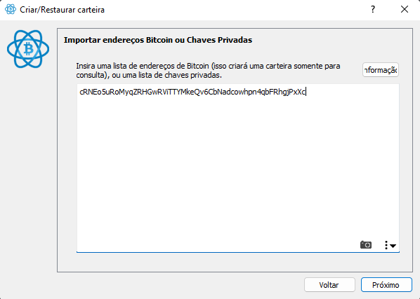

# BTCWallet
Projeto de Criar uma Carteira de Criptomoeda para Bitcoin

### Instale [Node.js](https://nodejs.org/pt)
### Abra o Terminal no VS Code

| Passos | Descrição | Comandos |
| --- | --- | --- |
| 1 | Verificar versões | `node -v` e `npm -v` |
| 2 | Iniciar | `npm init -y` |
| 2 | Instalar recursos | npm install `bit39` `bit32@2.0.6` `bitcoin-lib --save`
| 3 | Criar Pasta src e arquivo createwallet.js | [createwallet.js](https://github.com/AllanNunes2211/BTCWallet/blob/main/createwallet.js) |
| 4 | Crie um endereço de carteira bitcoin do testnet executando o arquivo | `node .\createwallet.js` |

Após executar o comando do passo 4 aparecerá as seguintes linhas de código:

```
Carteira gerada
Endereço:  tb1q7hlvz8gtttgx9zrgnzf9hzmc8ysag8x99x28cc
Chave privada:  cRNEo5uRoMyqZRHGwRViTTYMkeQv6CbNadcowhpn4qbFRhgjPxXc
Seed depend addict smart flag repeat thank bicycle raise combine again inch also
```

# [Electrum](https://electrum.org/#download)
- Instale o app Electrum
  
- Após a instalação, clique com o *botão direito* **no atalho** e entre no menu "propriedades".

- Adicione --testenet ao final do campo "Destino"
  


- Crie uma nova carteira na opção **importar endereços Bitcoin ou chaves privadas**


# Testenet

### Abra o site [Testnet](https://bitcoinfaucet.uo1.net/send.php) para verificar a validade do Endereço Gerado


